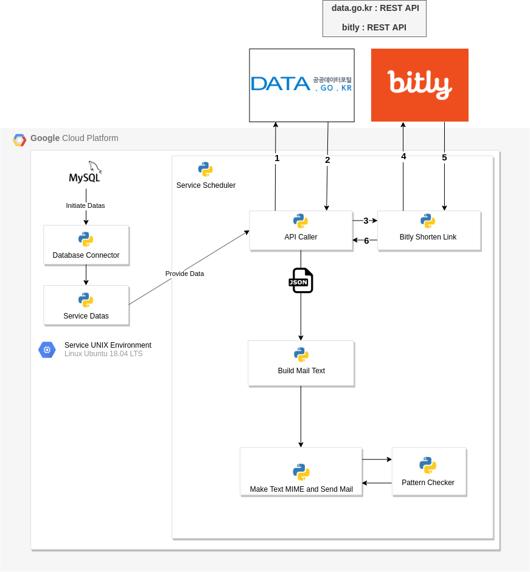

Kovid-Mail
===
***

#### Kovid-Mail은 금일 코로나 메일 서비스입니다.

#### 구독을 하시면 매일 아침 10시~11시 사이에 대한민국 코로나 확진자 관련 정보와 보건복지부 브리핑, 주요 뉴스를 받아보실수 있습니다.

***
pymysql connection error 1698이 발생한 경우에는 sql
    
    ALTER USER 'root'@'localhost' IDENTIFIED WITH mysql_native_password BY '(pw)'; 

쉘을 실행해주시기 바랍니다.

처음 서비스를 실행시키기 위해서는 ServiceSQLInitiator로 데이터베이스 구조를 초기화해주어야합니다. 이 작업을 하기 전에 config.yml파일에 설정값(API Key, Hostermail, pw등)을 설정한 상태에서 데이터베이스 구조 초기화를 해주시기 바랍니다.  
***
### 패치노트

- [Release Note 20210215(ver 1.0.0)]()

- [Release Note 20210227(ver 1.0.1)]()

- [Release Note 20210302(ver 1.1.0)]()

- [Release Note 20210307(ver 1.1.1-alpha)]()

- [Release Note 20210315(ver 1.1.1)]()

- [Release Note 20210317(ver 1.1.1)]()

- [Release Note 20210401(ver 1.2.0)]()

- [Release Note 20210403(ver 1.2.1)]()

- [Release Note 20210411(ver 1.2.1)]()

- [Release Note 20210628(ver 1.3.0)]()

***

### 서비스 운영정보

- PaaS : GCP Compute Engine VM Instance

- 서비스 환경

  - Ubuntu 18.04 LTS

  - Python 3.6.9(Migrated : 3.5 -> 3.6.9)

  - Script Daemonize + Scheduler

  - Server env Info : vCPU x 2 + 4GB RAM

- 서비스에서 사용된 주요 기술들

  - OSI 7 Layer : Transport, Application Layer(4,5,6,7) : POP3, SMTP, TLS(Transport Layser Security Connection)

  - API : XML,REST

  - Database : MySQL

  - CI : Jenkins

  - Job Scheduling

  - Linux

- 서비스 아키텍쳐

  
