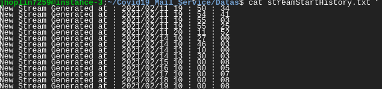
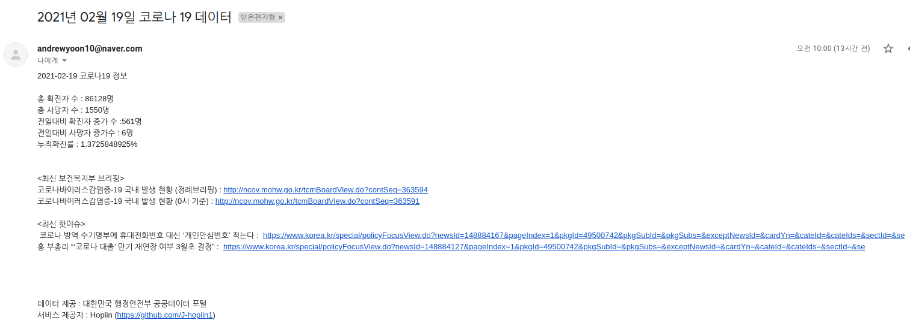

Open API와 SMTP, POP3 원리를 활용한 금일 코로나 정보 메일 자동화 서비스
===
***

### 서비스 운영 정보

- GCP(Google Cloud Engine) Compute Engine VM(Virtual Machine) Instance

- 기본적인 서비스 환경

  - Ubuntu 18.04 LTS
  
  - Python 3.6.9(Migrated)
  
  - GNU Screen
  
  - vCPU x 2 + 4GB RAM
  
  - Script Daemon + Scheduler 형태로 운영중입니다.
  
  - 평균적으로 청구되었던 리소스 비용 : 1750won/day

### Service Architecture

### Service Patch Note
- 2021년 02월 15일
  
  - 서비스 시작 : 오늘 기준 약 90일 정도만 운영할 예정입니다.
  
  - Patch Content : 보안문제 보완

    - Service Tester에 있어 보안적인 문제와 작은 예외처리 업데이트가 있습니다.
  
    - Servie Tester의 보안문제 : 악의적인 사용자가 한가지의 이메일을 다양하게 입력할 경우에, 추후 메일 전송 과정에 있어서 불필요한 시간 소요가 있을 가능성이 예상되어 중복 불가로 변경하였습니다.
  
    - 예외처리 : Service Tester를 작동시킨후 옵션을 고를때 정수 이외의 값이나 Keyboard Interrupt를 통해 비정상적인 종료가 되는 점을 막고자 예외처리를 하였습니다
    
    - 기능추가 : Service Tester에 대해서 구독자 목록조회, 구독자 삭제하기 기능을 추가했습니다
    
- 2021년 02월 27일

  - Patch Content : 모듈 세분화, 내부 순환 JSON구조 변경 및 prettify, Bug fix

  - 서비스 운영중 발생하였던 버그
    
    - 2021년 02월 24일에 이메일이 도착하지 않은것을 발견하였습니다. 그래서 ErrorLog를 살펴보았더니 이와 같이 [오류](https://github.com/J-hoplin1/Covid19_Mail_Service/blob/main/img/7.png)가 있었습니다. 저 오류의 원인은 크롤링한 브리핑 링크를 JSON에 저장한 후 textMaker에서 파싱하는 도중, briefTask2 라는 Key값이 없어 발생한것이 원인이었습니다. 이 오류가 발생했던 이유는 브리핑 내용이 2개가 고정일꺼라는 나의 고정관념으로 인해 생긴 오류였습니다. 그렇기에 이번 패치에서 textMaker내에서 paragraph를 완성할때 유동성 있게 조립할수 있도록 수정하였습니다.
  
  - 패치 내용

    1. apiCaller.py : 필요 데이터가 담긴 [JSON을 초기화하는 부분](https://github.com/J-hoplin1/Covid19_Mail_Service/blob/6e222fb3046f507fe245404df53131d71322917a/functionModules/apiCaller.py#L106)에서 브리핑 부분과 핫 이슈 부분을 따로 분류하였습니다. 또한 기존에 stream이 생성되면서 생기는 [JSON](https://github.com/J-hoplin1/Covid19_Mail_Service/blob/main/Datas/smtpSendDatas.json)을 참고해야하는 경우가 종종 생기는데, [한글이 유니코드로 깨지는 문제와, 한줄로 출력되어 생기는 가독성 문제를 해결하였습니다.](https://github.com/J-hoplin1/Covid19_Mail_Service/blob/6e222fb3046f507fe245404df53131d71322917a/functionModules/apiCaller.py#L126)
    2. smtpConnector.py : [약간의 클래스 내 메소드 세분화 작업이 있었습니다](https://github.com/J-hoplin1/Covid19_Mail_Service/blob/6e222fb3046f507fe245404df53131d71322917a/functionModules/smtpConnector.py#L39). 앞으로 추가할 Broadcasting기능 등 다른 기능에서 통합적으로 사용하기위해 클래스 구조를 약간 세분화했습니다.

- 2021년 03월 02일

  - Patch Content : Bug fix, Add function to service tester

  - 버그 내용
  
    - 메일 내용에서 불필요한 데이터로 인해 제대로된 정보제공이 되지 않는 버그가 있었습니다([오류](https://github.com/J-hoplin1/Covid19_Mail_Service/blob/main/img/8.png?raw=true)). 최신 핫이슈와 보건복지부 최신 브리핑 데이터 정보같은 경우에는 [중앙사고수습본부의 대한민국 코로나정보 공식 사이트](http://ncov.mohw.go.kr/)에서 크롤링을 통해서 가져옵니다. URL링크 같은 경우 정규표현식을 통해서 가져오게 되는데, 카드 뉴스 부분의 URL이 코드에 설정한 정규표현식 패턴에 매칭하여 스크랩되게 되었습니다. 이 문제를 해결하기 위해서 기존에는 파싱 하는 부분을 지정하지 않은 상태로 크롤링을 하였습니다. 사실 스크랩 부분을 구체화를 안시킨게 저의 큰 실수였던것 같습니다. 그렇기 때문에 이번 패치에서는 [크롤링 부분 구체화 작업](https://github.com/J-hoplin1/Covid19_Mail_Service/blob/4db9e64e705b1b7789b6d8fe781ee76faaf4f801/functionModules/apiCaller.py#L76)을 하였습니다.
  
  - 패치내용
  
    1. serviceTester.py : [데이터 백업기능](https://github.com/J-hoplin1/Covid19_Mail_Service/blob/4db9e64e705b1b7789b6d8fe781ee76faaf4f801/serviceTester.py#L96)이 생겼습니다. 현재 운영중인 서버에서는 MySQL을 통해 운영하고 있지만 간이 테스트를 하거나 개인적인 서비스 벤치마킹을 할때 백업기능이 필요하여 넣게 되었습니다.
    2. serviceTester.py : 베타기능이지만 [브로드캐스팅(Broadcasting)기능](https://github.com/J-hoplin1/Covid19_Mail_Service/blob/0c4bfc1681033670c8b3fd018eef59eaba857f61/serviceTester.py#L110)이 생겼습니다. 아직 베타이기 때문에 main branch에 merge를 하지는 않았습니다. 해당 기능을 어느정도 다듬고 개인적인 벤치마크 테스트가 끝나면 merge할 예정입니다

- 2021년 03월 07일

  - Patch Content : 이번 패치는 서비스 패치가 아닌 베타 기능 적용에 관한 내용입니다

  - 베타기능 내용 : 최신 보건복지부 브리핑, 최신 핫이슈의 긴 URL을 Bitly API를 이용하여 Shorten URL로 줄여서 가독성을 조금 증가시켜보았습니다.
  
  - 저 자신이 서비스를 제공받는 입장에서 서비스의 메일을 받고 나서 PC와 모바일 상에서의 가독성에 집중을 해보았습니다. PC환경에서 메일을 열 경우에는 그래도 넓은 화면덕분에 핫이슈 혹은 브리핑 부분의 긴 URL이 엄청 거슬리지는 않았지만 모바일 앱이나 웹 환경에서 보았을때는 가독성 측면에서 많이 떨어진다는것을 확인하였습니다. 
  
  - 사실 서비스를 처음 기획해보고 제작할때도 한 페이지에 코로나 정보와 핫이슈 브리핑이 한번에 보여졌으면 하는게 목표였으나 긴 URL로 인해 개선 방안을 항상 생각하고 있었습니다.
  
    - [PC환경에서의 이메일](https://github.com/J-hoplin1/Covid19_Mail_Service/blob/main/img/9.png?raw=true)
    - [모바일 앱에서의 이메일](https://github.com/J-hoplin1/Covid19_Mail_Service/blob/main/img/10.png?raw=true)
  
  - 그래서 단축 URL서비스를 제공하고 있는 Bitly의 Bitly API를 이용하여 URL을 단축 URL로 변환하여 보내보는것을 적용해보자 라고 생각하였고, 기존에 소개하였던 [Bitly API Repository](https://github.com/J-hoplin1/Lots-Of-Useful-Things/tree/main/ShortenURLWithbitly) 에서 함께 만들었던 단축 URL 자동변환기를 활용하여 적용해 보았습니다.
  - 적용 브랜치 : https://github.com/J-hoplin1/Covid19_Mail_Service/tree/Apply-Bitly
  - 적용 후 결과
    - [적용 후 이메일(모바일)](https://github.com/J-hoplin1/Covid19_Mail_Service/blob/main/img/11.png?raw=true)
    - 적용하면서 아직 해결하지 못한 부분
      - 위의 사진을 보면 알 수 있듯이 아직 핫이슈 부분을 해결하지 못하였습니다. 그 이유는 테스트 코드로 테스트를 하던 도중 Bitly API 호출 부분에서 오류가 나서 확인해 보았더니, 핫이슈 부분의 URL이 너무 길이 변환하지 못한다는 Response를 받았습니다.( https://github.com/J-hoplin1/Covid19_Mail_Service/blob/main/img/12.png?raw=true )
      - 이 부분에 대한 해결책을 앞으로 조금 생각해볼 예정입니다.
    - 이 단축 URL기능이 서비스에 적용된다면 가져올 수 있는 장/단점
      - 장점
        - 가독성이 더 좋아진다
      - 단점
        - 서비스를 제공받는 사용자 입장에서 이 URL이 어디로 이어지는 URL인지 직관적으로 알 수 없어지기 때문에 서비스에 대한 신뢰성이 떨어질 수 도 있고, 링크를 누르는게 꺼려질 수 도 있다.
 
- 2021년 03월 15일

  - Bitly 단축URL, Broadcasting기능 본 서비스에 적용 패치

- 2021년 03월 16일

  - [Server상에서 운영중인 SQL연동 코드 공개](https://github.com/J-hoplin1/Covid19_Mail_Service/tree/Server-Operating-Code-ver1/functionModules)         

### Source Code 기본정보

- Build ENV Langauge : Python 3.7.4

- [사용한 API](https://www.data.go.kr/tcs/dss/selectApiDataDetailView.do?publicDataPk=15043376) : REST, XML

- 주요 활용 : SMTP, TLS, POP3, API(XML) 

### TODOS

- [x] API Doc 분석 및 API 호출, 파서 단 만들기

- [x] API 응답 XML에 대한 전처리, JSON반환 부분만들기

- [x] Naver Mail SMTP/IMTP 설정하기

- [x] JSON 기반 텍스트 반환 클래스 구현 후 메일 전송 부분 만들기

- [x] 서비스 테스트 컨트롤러 만들기(옵션에는 서비스 시작, 구독자 추가, 종료 3개 있을것)

- [x] schedular 작성하여 특정 시간마다 실행되게끔 main stream 생성

- [x] GCP를 사용해 스케줄러 MainStream 

- [ ] AWS SES(Simple Email Service)를 활용하여 변경해보기

- [ ] Node.js를 이용해 사용자 이메일 데이터베이스 연동 자동화

- [ ] 비동기처리

### 기본적인 구현

- 구현 및 코드 설명은 블로그에 올릴 예정입니다.

