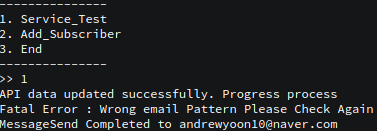
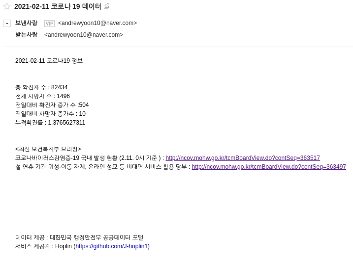

Open API와 SMTP, POP3 를 활용한 금일 코로나 정보 메일 자동화 서비스
===
***

##### 서비스 구독을 하고싶은 분들은 jhoplin7259@gmail.com으로 이메일을 보내주시면 됩니다

### 기본정보

- Langauge : Python 3.7.4

- [사용한 API](https://www.data.go.kr/tcs/dss/selectApiDataDetailView.do?publicDataPk=15043376) : REST, XML

- 주요 활용 : SMTP, TLS, POP3, API(XML) 

### TODOS

- [x] API Doc 분석 및 API 호출, 파서 단 만들기

- [x] API 응답 XML에 대한 전처리, JSON반환 부분만들기

- [x] Naver Mail SMTP/IMTP 설정하기

- [x] JSON 기반 텍스트 반환 클래스 구현 후 메일 전송 부분 만들기

- [x] 서비스 테스트 컨트롤러 만들기(옵션에는 서비스 시작, 구독자 추가, 종료 3개 있을것)

- [x] schedular 작성하여 특정 시간마다 실행되게끔 main stream 생성

- [x] GCP를 사용해 스케줄러 MainStream 

- [ ] AWS SES(Simple Email Service)를 활용하여 변경해보기

### 서비스 운영 정보

- Google Cloud Platform VM(Virtual Machine) Instance를 활용하여 운영하고있습니다

- 기본적인 서비스 환경

  - Ubuntu 16.04 LTS
  
  - Python 3.5

### 기본적인 구현

- 구현 및 코드 설명은 블로그에 올릴 예정입니다.

