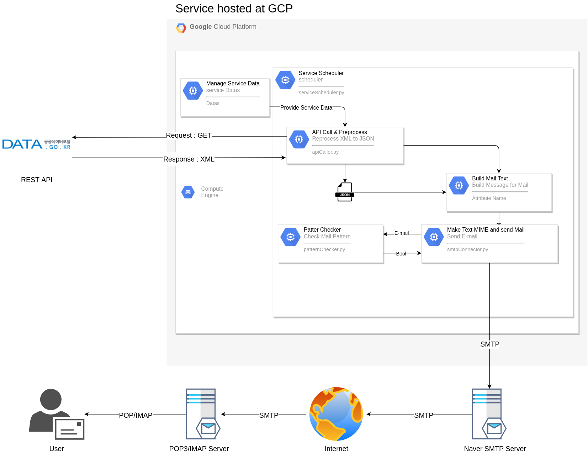

Open API와 SMTP, POP3 원리를 활용한 금일 코로나 정보 메일 자동화 서비스
===
***

### 서비스 운영 정보

- GCP(Google Cloud Engine) Compute Engine VM(Virtual Machine) Instance

- 기본적인 서비스 환경

  - Ubuntu 18.04 LTS
  
  - Python 3.6.9
  
  - GNU Screen
  
  - vCPU x 2 + 4GB RAM
  
  - Script Daemon형태로 운영중입니다.

### Service Architecture

### Service Patch Note
- 2021년 02월 15일
  
  - 서비스 시작 : 오늘 기준 약 90일 정도만 운영할 예정입니다.
  
  - Patch Content : 보안문제 보완

    - Service Tester에 있어 보안적인 문제와 작은 예외처리 업데이트가 있습니다.
  
    - Servie Tester의 보안문제 : 악의적인 사용자가 한가지의 이메일을 다양하게 입력할 경우에, 추후 메일 전송 과정에 있어서 불필요한 시간 소요가 있을 가능성이 예상되어 중복 불가로 변경하였습니다.
  
    - 예외처리 : Service Tester를 작동시킨후 옵션을 고를때 정수 이외의 값이나 Keyboard Interrupt를 통해 비정상적인 종료가 되는 점을 막고자 예외처리를 하였습니다
    
    - 기능추가 : Service Tester에 대해서 구독자 목록조회, 구독자 삭제하기 기능을 추가했습니다

### 기본정보

- Langauge : Python 3.7.4

- [사용한 API](https://www.data.go.kr/tcs/dss/selectApiDataDetailView.do?publicDataPk=15043376) : REST, XML

- 주요 활용 : SMTP, TLS, POP3, API(XML) 

### TODOS

- [x] API Doc 분석 및 API 호출, 파서 단 만들기

- [x] API 응답 XML에 대한 전처리, JSON반환 부분만들기

- [x] Naver Mail SMTP/IMTP 설정하기

- [x] JSON 기반 텍스트 반환 클래스 구현 후 메일 전송 부분 만들기

- [x] 서비스 테스트 컨트롤러 만들기(옵션에는 서비스 시작, 구독자 추가, 종료 3개 있을것)

- [x] schedular 작성하여 특정 시간마다 실행되게끔 main stream 생성

- [x] GCP를 사용해 스케줄러 MainStream 

- [ ] AWS SES(Simple Email Service)를 활용하여 변경해보기

- [ ] Node.js를 이용해 사용자 이메일 데이터베이스 연동 자동화

### 기본적인 구현

- 구현 및 코드 설명은 블로그에 올릴 예정입니다.

